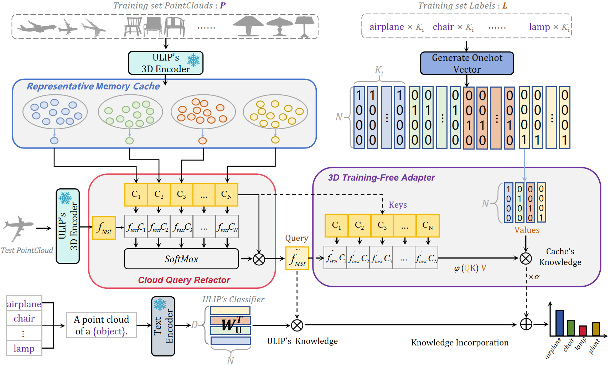

# PointTFA: Training-Free Clustering Adaption for Large 3D Point Cloud Models

# Introduction
PointTFA is a training-free adaptation of large 3D point cloud models. This approach effectively bridges the domain gap between ULIP pre-training and downstream point clouds. We propose a "Data-efficiency" (RMC) to capture robust representative knowledge in support memory, forming an efficient cache model that balances data dimension and baseline accuracy. Additionally, we present a reshaping technique (CQR) for projecting cache knowledge onto test features, enhancing the comprehensive understanding of cache information by test point clouds. Furthermore, PointTFA significantly improves the original capabilities of the ULIP pre-trained 3D backbone, achieving state-of-the-art performance in Training-free few-shot 3D Classification.

<div align="center">
  
</div>

## [Install environments]
The code is tested with CUDA==11.0 and pytorch==1.10.1\
```conda create -n tfa python=3.7.15``` \
```conda activate tfa``` \
```conda install pytorch==1.10.1 torchvision==0.11.2 torchaudio==0.10.1 cudatoolkit=11.3 -c pytorch -c conda-forge``` \
```pip install -r requirements.txt```

## [Download datasets and pre-trained models, put them in the right paths.]
Download the used datasets and pre-trained models from [here](https://console.cloud.google.com/storage/browser/sfr-ulip-code-release-research). For now, you ONLY need to download "modelnet40_normal_resampled" and "ckpt_pointbert_ULIP-2.pt". \
After you download the datasets and pre-trained models. By default the data folder should have the following structure:
```
./DATA |
-- labels.json |
-- templates.json |
-- /modelnet40
  -- modelnet40_normal_resampled |

./pretrained_ckpt |
-- ckpt_pointbert_ULIP-2.pt
```

## [Test on modelnet40] 
run ```main.py``` 
